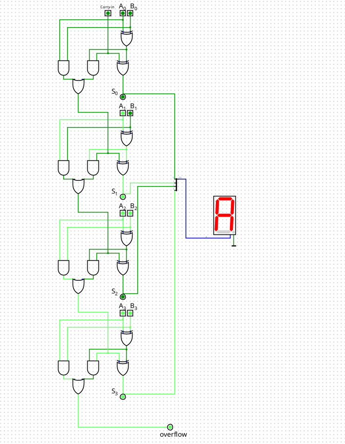

# Atividade: Somador de 4 Bits

Neste projeto, vou mostrar um somador digital de 4 bits feito através da composição de somadores completos de 1 bit. Com isso, será possível ver claramente como as operações são feitas corretamente, identificando quando acontece overflow e exibindo o resultado num display visual hexadecimal.

[Neste link](https://drive.google.com/drive/folders/1DxL5mLJzmOeSz1N4lS8tXcmy2-7_gi5z), será possível acessar o vídeo explicativo sobre o desenvolvimento e funcionamento somador de 4 bits.

---

## Somador de 1 Bit

Antes de falar mais sobre o somador de 4 bits, é importante entender primeiro como funciona o somador de 1 bit.

    Somador de 1 bit 
    

### Entradas e Saídas

- **Entradas:**
  - Bit A
  - Bit B
  - Carry-in (que é como uma "sobra" vinda de uma soma anterior)

- **Saídas:**
  - Soma
  - Carry-out

### Funcionamento das Portas Lógicas

Esses resultados vêm das portas lógicas XOR, AND e OR:

- **Porta XOR:** Só deixa passar um bit se APENAS uma das entradas tiver valor 1.
  - Exemplo: Se A = 1, B = 0, a XOR libera e a soma fica 1.
  - Exemplo: Se A = 1, B = 1, a XOR bloqueia e a soma fica 0.

  

    Entrada A = 1 e B = 0 
    

- **Porta AND:** É ativada apenas quando as duas entradas forem 1.
  - Exemplo: Se A = 1, B = 1, a AND libera o carry-out, que fica 1. Assim, a soma 1 + 1 dá 10 em binário, ou seja, 2 em decimal, o que está correto.

    

    Entrada A = 1 e B = 1 
    

- **Porta OR:** É ativada quando pelo menos uma das entradas forem 1.
  - Exemplo: Se A = 1, B = 1, a AND "libera a passagem" para o OR. Com uma das entradas do OR sendo 1, enquanto que a outra vale 0, a passagem é "liberada" para o carry-out, que irá valer 1.
   

    Entrada A = 1, B = 1 e carry-in = 1 
    

## Somador de 4 Bits

Agora, continuando para o somador de 4 bits, ele é basicamente uma sequência de quatro somadores completos de 1 bit, onde o carry-out de um passa como carry-in do próximo, formando uma soma completa com 4 bits.

Dessa forma, é possível fazer somas binárias maiores mantendo precisão.

    Somador de 4 Bits 
    

## Overflow

O overflow acontece quando a soma é maior que a capacidade dos 4 bits disponíveis (maior que 1111 binário, ou 15 em decimal). O overflow fica visível pelo carry-out do último bit.

    Indicação de Overflow 
    

No exemplo acima, é possível ver que tínhamos como valores, em hexadecimal: 
- A_1 = 2¹;
- A_2 = 2²; B_2 = 2²; 
- A_3 = 2³; B_3 = 2³.

Com isso, temos a soma: 2 + 4 + 4 + 8 + 8 = 26. No entanto, como um somador de 4 bits só é capaz de armazenar valores que correspondem a até 1111, ou seja, 15, quando esse valor é ultrapassado, ocorre o overflow. Nesse sentido, o overflow da figura "consome" 16 bits, e o restante é a soma que sobra, ou seja, 26 - 16 = 10, o que corresponde a A no sistema hexadecimal, resultado que é possível visualizar na figura.

## Display Visual

Por fim, para facilitar ainda mais, o projeto tem um display visual que mostra o resultado da soma de maneira simples e prática.

    Display Visual 
    

